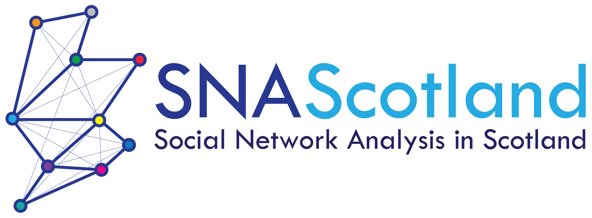
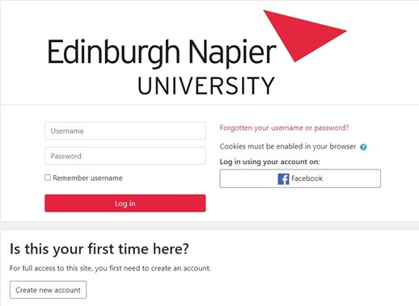
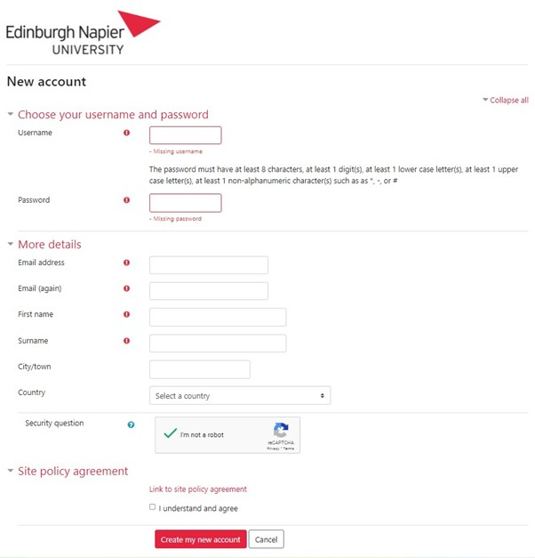
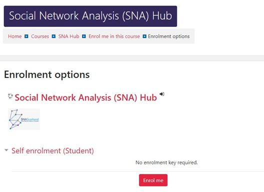

# Thinking about using Social Network Analysis – try the SNA Hub  

In 2021, the [Social Network Analysis in Scotland group (SNAS)](https://www.sps.ed.ac.uk/research/research-project/social-network-analysis-scotland-group-snas) developed the Social Network Analysis (SNA) Hub that is hosted on the Edinburgh Napier University (ENU) Open Moodle platform. The SNA Hub can be accessed [here](https://open.napier.ac.uk/course/view.php?id=40).

The SNA Hub is intended to be a beginner’s guide to Social Network Analysis and how to use this methodology. The SNA Hub aims to act as a resource hub for anyone starting out with SNA, including an overview of some methods and metrics, along with short introduction/taster videos on relevant software for SNA and Network Science. The SNA Hub also has links to relevant conferences and seminars on social network analysis, including the SNAS seminar series. 

If you aren’t a ENU member of staff or ENU student and don’t have an ENU account (or you would like to share with colleagues outside of ENU), then please follow the instructions provided below to access the SNA Hub. 

First go to the [Open Moodle webpage](https://open.napier.ac.uk/), you can then select create an account.

To create an account, you just need to complete the form, as indicated in the screenshot below. 

Once you have an account, and have logged in, you can then navigate to the SNA Hub page and enroll. Once you have enrolled, you will be able to access all the content and resources on the SNA Hub and start (or continue) your journey using Social Network Analysis. 

If you have any questions about the SNA Hub or SNAS, please feel free to get in touch. 

You can also follow SNAS on Twitter: [@SNA_Scotland](https://twitter.com/SNA_Scotland)

And join the mailing list: https://www.jiscmail.ac.uk/cgi-bin/webadmin?A0=SNAS 
